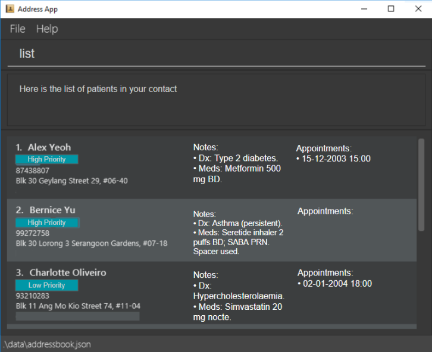

# MediSaveContact

A desktop application for healthcare professionals to manage patient contact information and care notes efficiently.

## About

MediSaveContact is designed for nurses and healthcare workers who provide care outside traditional hospital settings. The application focuses on quick data entry and retrieval through a command-line interface, making it faster to manage patient information during busy schedules.

## Who This Is For

**Community nurses** who visit patients at home and need to:
- Quickly access patient information during visits
- Add notes and updates without complex software
- Work with patient records offline
- Handle multiple patients efficiently

## What It Does

- **Fast patient lookup**: Find patients quickly by typing commands
- **Simple note-taking**: Add remarks and care notes with minimal typing
- **Offline operation**: Works without internet connection
- **Lightweight**: Runs on basic computers without heavy system requirements

## Key Benefits

The application prioritizes speed and simplicity over complex features. Healthcare professionals can manage hundreds of patient records through keyboard commands, reducing the time spent on administrative tasks and allowing more focus on patient care.

---

*This project is based on the AddressBook-Level3 project created by the [SE-EDU initiative](https://se-education.org).*

