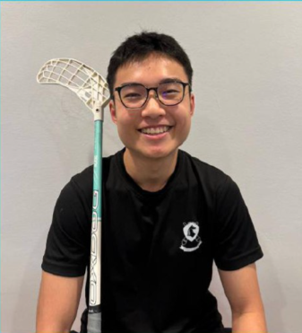
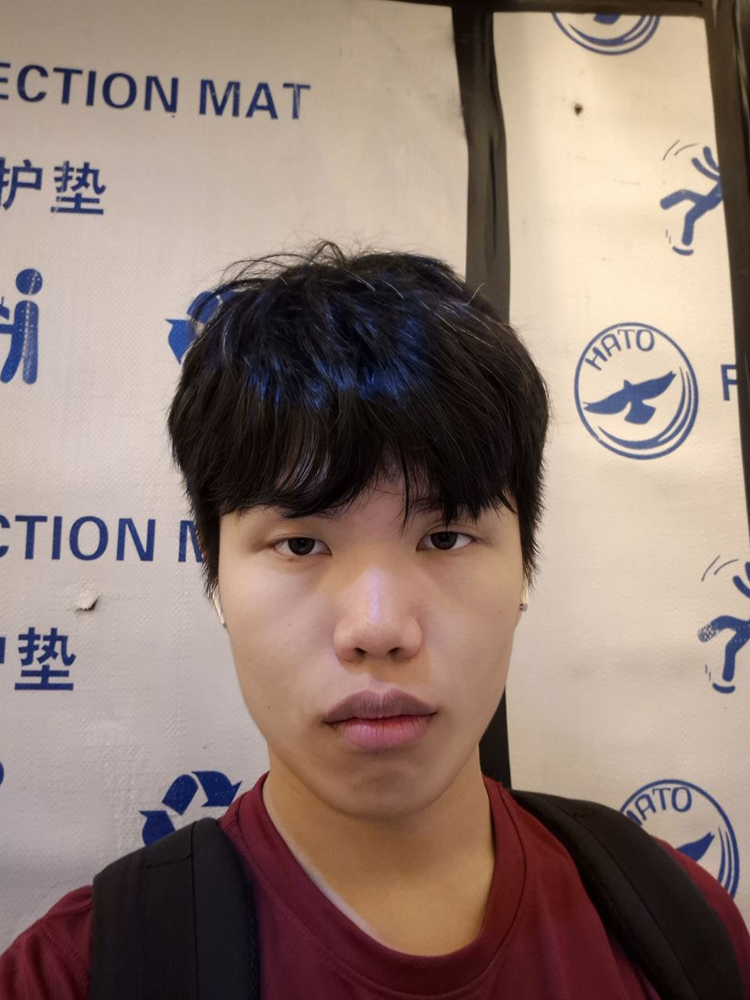

We are a team based in the [School of Computing, National University of Singapore](https://www.comp.nus.edu.sg).

## Project team

### Chen Kaiwen

[[github](http://github.com/ckwflash)]
[[portfolio](team/johndoe.md)]

* Role: Team Lead
* Responsibilities:
    * Make key project decisions 
    * Ensure project milestones are met and deliverables are completed on time
    * Facilitate team meetings 

### Pek Yiheng

[[github](https://github.com/pekyiheng)]
[[portfolio](team/johndoe.md)]

* Role: Documentation Lead
* Responsibilities:
    * Create and maintain comprehensive project documentation
    * Ensure all user guides and developer documentation are up-to-date
    * Standardize documentation format and style across the project

### Chua Kai Jie, Emerson

[[github](https://github.com/fatbolster)]
[[portfolio](team/johndoe.md)]

* Role: Testing Lead
* Responsibilities:
    * Define and maintain project's testing strategy (unit, integration and system)
    * Come up with test cases and ensure new versions pass them before release
    * Coordinate automated testing pipelines and continuous integration workflows

### Or Fu Xiang

[[github](https://github.com/tofuuu67)]
[[portfolio](team/johndoe.md)]

* Role: UI Lead
* Responsibilities:
    * Design and implement user interface components and layouts
    * Ensure consistent UI/UX design patterns across the application
    * Manage frontend development and user interaction features

### Hao Jun Mah

[[github](https://github.com/haojun-mah)]
[[portfolio](team/johndoe.md)]

* Role: Code Quality & Integration Lead
* Responsibilities:
    * Enforce coding standards and best practices across the project
    * Set up and maintain continuous integration pipelines and quality gates
    * Coordinate integration between different modules and resolve conflicts
